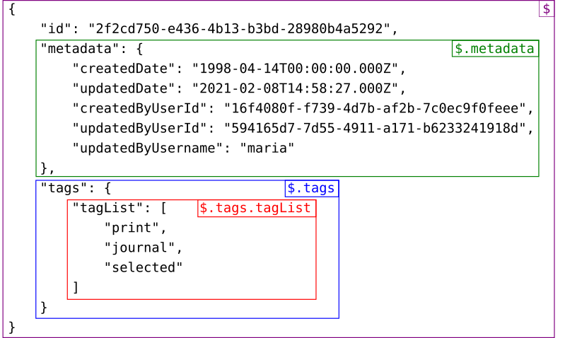

== Reference

=== Data type conversion

When reading data from a data source, Metadb will automatically adjust
column data types in a number of cases:

* A data type in the source has changed in a way that cannot be
  applied safely by Metadb without more information.

* A data type in the source has changed to a type that is not
  supported by Metadb.

* A data type in the source can be converted safely to a type that is
  more performant.

Each type conversion is applied in one of two ways: either by the
stream processor converting a record-at-a-time, or later by
"inferring" types from previously updated data.

==== Record-at-a-time

This table summarizes conversions that are performed a
record-at-a-time by the stream processor:

[width=80%]
[%header,cols="2,^1,^1,^1,^1"]
|===
|*Data type conversions*
^|*To numeric*
^|*To uuid*
^|*To jsonb*
^|*To text*

|From boolean
|
|
|
|✅

|From smallint
|✅
|
|
|✅

|From integer
|✅
|
|
|✅

|From bigint
|✅
|
|
|✅

|From real
|✅
|
|
|✅

|From double precision
|✅
|
|
|✅

|From numeric
|
|
|
|✅

|From date
|
|
|
|✅

|From time
|
|
|
|✅

|From time with timezone
|
|
|
|✅

|From timestamp
|
|
|
|✅

|From timestamp with timezone
|
|
|
|✅

|From uuid
|
|
|
|✅

|From json
|
|
|✅
|✅

|From jsonb
|
|
|
|✅
|===

==== Inferred from data

At present the only inferred type is `uuid`:

[width=80%]
[%header,cols="2,^1,^1,^1,^1"]
|===
|*Data type conversions*
^|*To numeric*
^|*To uuid*
^|*To jsonb*
^|*To text*

|From text/varchar
|
|✅
|
|
|===

Types also can be set manually via the `alter table` command.

=== Functions

==== System information

[%header,cols="1,2l,2"]
|===
|Name
|Return type
|Description

|`mdblog(interval)`
|table (
    log_time timestamptz(3),
    error_severity text,
    message text
)
|Returns recent log messages during the specified interval, or during
 the past 24 hours if no interval is given

|`mdbusers()`
|table (
    username text
)
|Returns a list of registered users

|`mdbversion()`
|text
|Returns the Metadb version

|`ps()`
|table (
    dbname text,
    username text,
    state text,
    realtime text,
    query text
)
|Returns the status and elapsed running time of current query
 processes
|===

[discrete]
===== Examples

Show log messages from the past hour, and from the past 24 hours:

----
select * from mdblog('1 hour');
----
----
select * from mdblog();
----

Show the current Metadb version:

----
select mdbversion();
----

=== System tables

==== metadb.base_table

The table `metadb.base_table` stores information about tables that are
extracted from data sources or are transformed from those tables.

[%header,cols="1,1l,3"]
|===
|Column name
|Column type
|Description

|`schema_name`
|varchar(63)
|The base table schema name

|`table_name`
|varchar(63)
|The base table name

|`source_name`
|varchar(63)
|Name of the data source the table is extracted from

|`transformed`
|boolean
|True if the table is transformed from another table

|`parent_schema_name`
|varchar(63)
|Schema name of the parent table, if this is a transformed table

|`parent_table_name`
|varchar(63)
|Table name of the parent table, if this is a transformed table
|===

==== metadb.log

The table `metadb.log` stores logging information for the system.

[%header,cols="1l,1l,3"]
|===
|Column name
|Column type
|Description

|log_time
|timestamptz(3)
|Timestamp when the log entry was written

|error_severity
|text
|Logging level: (from least to most severe) INFO, WARNING, ERROR,
 FATAL

|message
|text
|The log message
|===

==== metadb.table_update

The table `metadb.table_update` stores information about the updating
of certain tables.

[%header,cols="1,1l,3"]
|===
|Column name
|Column type
|Description

|`schema_name`
|varchar(63)
|Schema name of the updated table

|`table_name`
|varchar(63)
|Table name of the updated table

|`last_update`
|timestamptz
|Timestamp when the table was last updated successfully

|`elapsed_real_time`
|real
|Wall-clock time in seconds of the last completed update process
|===

=== Configuration parameters

==== checkpoint_segment_size

The `checkpoint_segment_size` parameter sets the maximum number of
change events that will be processed before a checkpoint occurs.  The
default value is `'3000'`.  The server must be restarted for this
parameter to take effect.

==== external_sql_folio

The `external_sql_folio` parameter sets the Git reference in the
folio-analytics repository to be used for running external SQL.

For example:

----
alter system set external_sql_folio = 'refs/tags/v1.8.0';
----

The default value is `''`, which disables running the external SQL.

==== external_sql_reshare

The `external_sql_reshare` parameter sets the Git reference in the
folio-reshare repository to be used for running external SQL.  The
default value is `''`, which disables running the external SQL.  Also
see *Reference > Configuration parameters > external_sql_folio*.

// ==== kafka_sync_concurrency

// The `kafka_sync_concurrency` parameter sets the number of
// concurrent Kafka consumers that will run simultaneously during data
// source synchronization.  The default value is '1'.  At present the
// recommended value is '1'.  The server must be restarted for this
// parameter to take effect.

==== max_poll_interval

The `max_poll_interval` parameter sets a timeout in milliseconds for
the interval between polls of a Kafka data source, during which change
events are processed.  The default value is `'1800000'`.  The server
must be restarted for this parameter to take effect.

=== External SQL directives

Metadb allows scheduling external SQL files to run on a regular basis.
At present this feature is enabled automatically when the "folio" or
"reshare" module has been specified in the data source.  Details such
as the location of the SQL files and when they are run are currently
hardcoded but will be configurable in the future.

Each SQL statement should be separated from others by an empty line,
and any tables created should not specify a schema name.

Comment lines beginning with `--metadb:` are used for special
directives; each directive should be on a separate line.

It is suggested that each SQL file begin with a `--metadb:table`
directive, followed by an empty line, for example:

----
--metadb:table library_patrons

drop table if exists library_patrons;

create table library_patrons as
select . . . ;
----

==== --metadb:table

The `--metadb:table` directive declares that the SQL file updates a
specific table.  This allows Metadb to report on the status of the
update in the `metadb.table_update` system table.  The directive takes
the form:

----
--metadb:table <table>
----

The specified table should not contain a schema name.

For example:

----
--metadb:table user_group
----

=== Statements

Metadb extends SQL with statements for configuring and administering
the server.  These statements are only available when connecting to
the Metadb server (not the PostgreSQL server for the underlying
database).

==== alter data source

Change the configuration of a data source

[source,subs="verbatim,quotes"]
----
alter data source `*_source_name_*`
    options ( [ add | set | drop ] *_option_* ['*_value_*'] [, ... ] )
----

[discrete]
===== Description

`alter data source` changes connection settings for a data source.

NOTE: `alter data source` currently requires restarting the server
before it will take effect.

[discrete]
===== Parameters

[frame=none,grid=none,cols="1,2"]
|===
|`*_source_name_*`
|The name of an existing data source.

|`options ( [ add \| set \| drop ] *_option_* ['*_value_*'] [, ... ] )`
|Connection settings and other configuration options for the data
 source.
|===

[discrete]
===== Options

See `create data source`.

[discrete]
===== Examples

Change the consumer group:

----
alter data source sensor options (set consumer_group 'metadb_sensor_1');
----

==== alter system

Change a server configuration parameter

[source,subs="verbatim,quotes"]
----
alter system set `*_configuration_parameter_*` = `*_value_*`
----

[discrete]
===== Description

`alter system` changes a server configuration parameter setting.  Some
parameters require restarting the server before they will take effect.
See *Reference > Configuration parameters* for documentation of
available parameters.

Configuration values can be displayed via the `list config` command.

[discrete]
===== Parameters

[frame=none,grid=none,cols="1,2"]
|===
|`*_configuration_parameter_*`
|Name of a configuration parameter.

|`*_value_*`
|New value of the parameter.  This is always a string constant.
|===

[discrete]
===== Examples

----
alter system set kafka_sync_concurrency = '1';
----

==== alter table

Change a table definition

[source,subs="verbatim,quotes"]
----
alter table `*_table_name_*`
    alter column `*_column_name_*` type `*_data_type_*`
----

[discrete]
===== Description

`alter table` changes the definition of a table that is extracted from
a data source.

NOTE: `alter table` currently requires restarting the server before it
will take effect.

[discrete]
===== Parameters

[frame=none,grid=none,cols="1,2"]
|===
|`*_table_name_*`
|Schema-qualified name of a main table.

|`*_column_name_*`
|Name of a column to alter.

|`*_data_type_*`
|The new data type of the column.  The only type currently supported
 is `uuid`.
|===

[discrete]
===== Examples

Change a column type to `uuid`:

----
alter table library.patron__ alter column patrongroup_id type uuid;
----

==== create data mapping

Define a new mapping for data transformation

[source,subs="verbatim,quotes"]
----
create data mapping for *_mapping_type_*
    from table `*_table_name_*` column `*_column_name_*` path '*_object_path_*'
    to '*_target_identifier_*'
----

[discrete]
===== Description

`create data mapping` defines mapping rules for data transformation.
The output of a mapping is written to a new column or table based on
the specified target identifier.

In JSON mapping, the specified path identifies a JSON object or array
to transform.  For example, the path `'$.a.b'` is used to refer to an
object or array named `b` contained within an object or array named
`a`.  The path `'$'` means the outermost enclosing object.  Note that
an object or array will not be transformed unless all of its parents
are also transformed; for example, a mapping from path `'$.a.b'` will
be applied only if mappings are also defined for both the paths
`'$.a'` and `'$'` within the same table and column.

[discrete]
===== Parameters

[frame=none,grid=none,cols="1,2"]
|===
|`*_mapping_type_*`
|The type of data mapping.  The only type currently supported is
 `json`.

|`*_table_name_*`
|The table to transform.

|`*_column_name_*`
|The column to transform.

|`'*_object_path_*'`
|Path to a JSON object or array.

|`'*_target_identifier_*'`
| A short identifier to be used in naming the transformed data.  The
  identifier must be in all lowercase and no more than 16 characters
  in length.  It must also be unique for the transformed column; in
  other words, no two paths can be mapped to the same target
  identifier.
|===

[discrete]
===== Examples

Create JSON mappings to transform an object at `$.metadata` and an
array at `$.tags.tagList`:

----
create data mapping for json
    from table library.inventory__ column jsondata path '$'
    to 't';

create data mapping for json
    from table library.inventory__ column jsondata path '$.metadata'
    to 'metadata';

create data mapping for json
    from table library.inventory__ column jsondata path '$.tags'
    to 'tags';

create data mapping for json
    from table library.inventory__ column jsondata path '$.tags.tagList'
    to 'taglist';
----

==== create data origin

Define a new data origin

[source,subs="verbatim,quotes"]
----
create data origin `*_origin_name_*`
----

[discrete]
===== Description

`create data origin` defines a new origin.  An origin name can be
stored by Metadb in the `__origin` column to tag individual records.
The use and meaning of origins are typically defined by the
application or by a Metadb module, but in general origins allow
grouping data independently of data sources.  This can be useful
because data sources may be dictated by how the data are collected,
e.g. geographically in a sensor network.

[discrete]
===== Parameters

[frame=none,grid=none,cols="1,2"]
|===
|`*_origin_name_*`
|A unique name for the data origin to be created.
|===

[discrete]
===== Examples

Create a new origin `test_origin`:

----
create data origin test_origin;
----

==== create data source

Define a new external data source

[source,subs="verbatim,quotes"]
----
create data source `*_source_name_*` type *_source_type_*
    options ( *_option_* '*_value_*' [, ... ] )
----

[discrete]
===== Description

`create data source` defines connection settings for an external data
source.

The new data source starts out in synchronizing mode, which pauses
periodic transforms and running external SQL.  After no new snapshot
records have been received for a significant period of time, which
suggests that the initial snapshot has likely finished streaming, the
message "source snapshot complete (deadline exceeded)" will be written
to the log.  To complete the synchronization, the Metadb server should
be stopped in order to run `metadb endsync`, and after the "endsync"
has completed, the Metadb server can be started again.

[discrete]
===== Parameters

[frame=none,grid=none,cols="1,2"]
|===
|`*_source_name_*`
|A unique name for the data source to be created.

|`*_source_type_*`
|The type of data source.  The only type currently supported is
 `kafka`.

|`options ( *_option_* '*_value_*' [, ... ] )`
|Connection settings and other configuration options for the data
 source.
|===

[discrete]
===== Options for data source type "kafka"

[frame=none,grid=none,cols="1,3"]
|===
|`brokers`
|Kafka bootstrap servers (comma-separated list).

|`security`
|Security protocol: `'ssl'` or `'plaintext'`.  The default is `'ssl'`.

|`topics`
|Regular expressions matching Kafka topics to read (comma-separated
 list).

|`consumer_group`
|Kafka consumer group ID.

|`schema_pass_filter`
|Regular expressions matching schema names to accept (comma-separated
 list).

|`schema_stop_filter`
|Regular expressions matching schema names to ignore (comma-separated
 list).

|`table_stop_filter`
|Regular expressions matching table names to ignore (comma-separated
 list).

|`trim_schema_prefix`
|Prefix to remove from schema names.

|`add_schema_prefix`
|Prefix to add to schema names.

|`map_public_schema`
|Set a new target schema for tables originating in the `public`
 schema.  For these tables, `add_schema_prefix` will not be added to
 the target schema if `map_public_schema` is set.

|`module`
|Name of pre-defined configuration.
|===

[discrete]
===== Examples

Create `sensor` as a `kafka` data source:

----
create data source sensor type kafka options (
    brokers 'kafka:29092',
    topics '^metadb_sensor_1\.',
    consumer_group 'metadb_sensor_1_1',
    add_schema_prefix 'sensor_',
    table_stop_filter '^testing\.air_temp$,^testing\.air_temp_avg$'
);
----

==== create schema

Define a new schema

[source,subs="verbatim,quotes"]
----
create schema for user `*_user_name_*`
----

[discrete]
===== Description

`create schema` defines a new schema.  At present this command only
supports creating a user schema, which serves as a workspace for a
user.

Typically user schemas are created automatically by `create user`.
However, if a user already exists and is registered, but does not have
a user schema, `create schema` can be used to create it.

[discrete]
===== Parameters

[frame=none,grid=none,cols="1,2"]
|===
|`*_user_name_*`
|The name of the user, which will also be the name of the new schema.
|===

[discrete]
===== Examples

Register an existing user `jane` and create its user schema:

----
register user jane;

create schema for user jane;
----

==== create user

Define a new database user

[source,subs="verbatim,quotes"]
----
create user `*_user_name_*` with *_option_* '*_value_*' [, ... ]
----

[discrete]
===== Description

`create user` defines a new database user and registers it with the
Metadb instance, which allows it to receive access privileges.  In
addition, `create user` creates a schema having the same name as the
user, if the schema does not exist, and grants the user privileges on
the schema.  The schema is intended as a workspace for the user.

If a user already exists but is not registered or does not have a user
schema, `create user` cannot be used to complete the process.
Instead, `register user` and `create schema for user` are provided for
this purpose.

[discrete]
===== Parameters

[frame=none,grid=none,cols="1,2"]
|===
|`*_user_name_*`
|The name of the new user.

|`with ( *_option_* '*_value_*' [, ... ] )`
|Configuration options for the new user.
|===

[discrete]
===== Options

[frame=none,grid=none,cols="1,3"]
|===
|`password`
|Sets the user's password.

|`comment`
|Stores a comment about the user, e.g. the user's real name.  The
comment can be viewed in psql using the `\du+` command, or in other
user interfaces.
|===

[discrete]
===== Examples

Create a user `wegg` and add it to this Metadb instance:

----
create user wegg with password 'LZn2DCajcNHpGR3ZXWHD', comment 'Silas Wegg';
----

==== deregister user

Deregister a user from having database privileges

[source,subs="verbatim,quotes"]
----
deregister user `*_user_name_*`
----

[discrete]
===== Description

`deregister user` removes the ability to have database privileges from
a user that was previously added with `register user`.  It
automatically executes `revoke access on all` and also prevents
subsequent `grant` commands.

[discrete]
===== Parameters

[frame=none,grid=none,cols="1,2"]
|===
|`*_user_name_*`
|The name of the user to deregister.
|===

[discrete]
===== Examples

----
deregister user wegg;
----

==== drop data mapping

Remove a data mapping configuration

[source,subs="verbatim,quotes"]
----
drop data mapping for *_mapping_type_*
    from table `*_table_name_*` column `*_column_name_*` path '*_object_path_*'
----

[discrete]
===== Description

`drop data mapping` removes a data mapping configuration.

[discrete]
===== Parameters

[frame=none,grid=none,cols="1,2"]
|===
|`*_mapping_type_*`
|The type of data mapping.

|`*_table_name_*`
|The table being transformed.

|`*_column_name_*`
|The column being transformed.

|`'*_object_path_*'`
|The JSON path.
|===

[discrete]
===== Examples

Remove a data mapping:

----
drop data mapping for json
    from table library.inventory__ column jsondata path '$.tags.tagList';
----

==== drop data source

Remove a data source configuration

[source,subs="verbatim,quotes"]
----
drop data source `*_source_name_*`
----

[discrete]
===== Description

`drop data source` removes a data source configuration.

NOTE: `drop data source` currently requires restarting the server
before it will take effect.

[discrete]
===== Parameters

[frame=none,grid=none,cols="1,2"]
|===
|`*_source_name_*`
|The name of an existing data source.
|===

[discrete]
===== Examples

Drop a data source `sensor`:

----
drop data source sensor;
----

==== drop user

Remove a database user

[source,subs="verbatim,quotes"]
----
drop user `*_user_name_*`
----

[discrete]
===== Description

`drop user` removes a database user.  Before doing so, it attempts to
find and revoke most authorizations held by the user that would
typically prevent it from being removed.

If a user is registered in more than one Metadb instance, `drop user`
will not be able to remove all authorizations.  In that case, use
`deregister user` in each of the instances, and then issue `drop
user`.

[discrete]
===== Parameters

[frame=none,grid=none,cols="1,2"]
|===
|`*_user_name_*`
|The name of the user to be removed.
|===

[discrete]
===== Examples

Remove a user `wegg`:

----
drop user wegg;
----

==== grant

Enable access to data

[source,subs="verbatim,quotes"]
----
grant access
    on { table `*_table_name_*` | function `*_function_name_*` | all }
    to `*_user_name_*`
----

[discrete]
===== Description

The `grant` command grants a user access privileges to Metadb-managed
tables and functions.  It differs from a SQL grant command in that the
privileges continue to be valid if a table or function is dropped and
recreated.

Metadb-managed tables and functions include:

* System tables such as `metadb.table_update`
* System functions such as `public.mdblog(interval)`
* Main and current tables streamed from data sources
* Transformed tables such as from JSON or MARC formats
* Tables created by automated execution of external SQL

WARNING: Issuing the command `grant access on all` allows a user to
access all Metadb-managed tables and functions.

[discrete]
===== Parameters

[frame=none,grid=none,cols="1,2"]
|===
|`*_table_name_*`
|An existing table.

|`*_function_name_*`
|An existing function.

|`*_user_name_*`
|An existing user to be granted access.
|===

[discrete]
===== Examples

To grant a user `anna` access to a single table:

----
grant access on table library.patrongroup to anna;
----

To grant a user `bob` access only to a single table and to nothing
else:

----
revoke access on all from bob;

grant access on table library.patrongroup to bob;
----

==== list

Show the value of a system variable

[source,subs="verbatim,quotes"]
----
list `*_name_*`
----

[discrete]
===== Description

`list` shows the current setting of various system configurations and
other variables.

[discrete]
===== Parameters

[frame=none,grid=none,cols="1,3,8"]
|===
|`*_name_*`
|
|

|
|`config`
|Server configuration parameter settings.

|
|`data_mappings`
|Configured data mappings.

|
|`data_origins`
|Configured data origins.

|
|`data_sources`
|Configured data sources.

|
|`status`
|Current status of system components.
|===

[discrete]
===== Examples

----
list status;
----

==== purge data

Delete data or database objects

[source,subs="verbatim,quotes"]
----
purge data drop table `*_table_name_*` [, ... ]
----

WARNING: `purge data` deletes data permanently.  It cannot be undone.

[discrete]
===== Description

`purge data` deletes all data stored in one or more database objects.

The form `purge data drop table` removes specified main tables.  This
also results in the corresponding current tables being removed,
because of the parent-child relationship of main tables and current
tables.

WARNING: `purge data drop table` not only removes the specified main
tables but also removes their associated current tables.

Due to concurrency control, `purge data drop table` has to acquire
stream processing or table locks in order to finish executing.  It
automatically waits until it can continue safely.

[discrete]
===== Parameters

[frame=none,grid=none,cols="1,2"]
|===
|`*_table_name_*`
|The schema-qualified name of the main table to drop.
|===

[discrete]
===== Examples

Remove main tables `+table1__+` and `+table2__+` and their
corresponding current tables `+table1+` and `+table2+`:

----
purge data drop table library.table1__, library.table2__;
----

==== register user

Register an existing user to receive database privileges

[source,subs="verbatim,quotes"]
----
register user `*_user_name_*`
----

[discrete]
===== Description

`register user` associates an existing user with the Metadb instance.
This has the effect of allowing the user to be granted privileges in
the database via the `grant` command.

Normally there is no need to issue `register user`, because `create
user` executes it automatically.  However, if an existing user was
created in some other way, `register user` can enable it for the
Metadb instance.

[discrete]
===== Parameters

[frame=none,grid=none,cols="1,2"]
|===
|`*_user_name_*`
|The name of the user to register.
|===

[discrete]
===== Examples

----
register user beatrice;
----

==== revoke

Disable access to data

[source,subs="verbatim,quotes"]
----
revoke access
    on { table `*_table_name_*` | function `*_function_name_*` | all }
    from `*_user_name_*`
----

[discrete]
===== Description

The `revoke` command revokes access to tables.

[discrete]
===== Parameters

[frame=none,grid=none,cols="1,2"]
|===
|`*_table_name_*`
|An existing table.

|`*_function_name_*`
|An existing function.

|`*_user_name_*`
|An existing user that will have access removed.
|===

[discrete]
===== Examples

To disable access by a user `bob` to a table:

----
revoke access on table library.patrongroup from bob;
----
